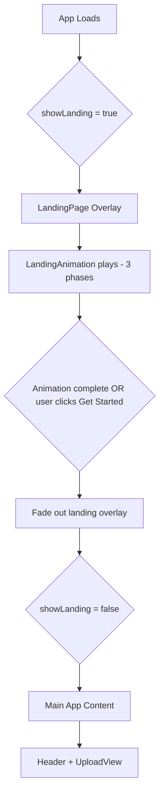
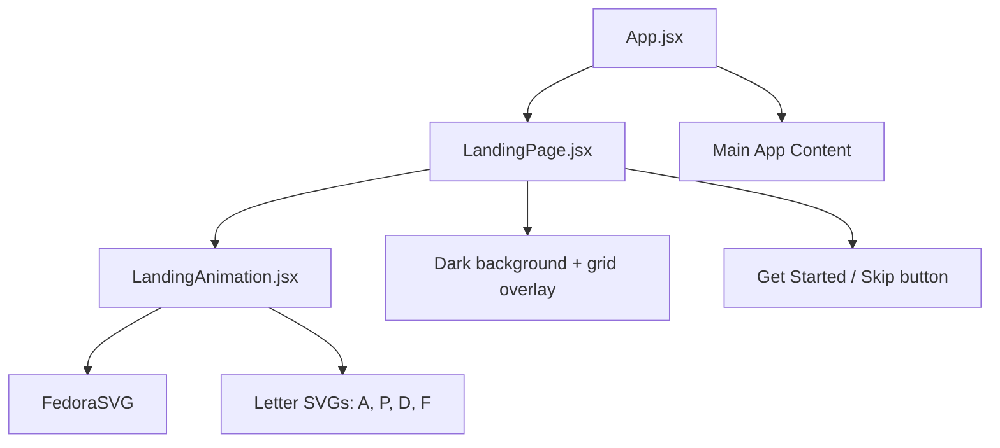

# Plan: Integrate LandingPageAnimation into the Web App

## Overview

Add the `LandingPageAnimation` component to the main `web/` app so users see a branded animation when they first open the application, which then transitions into the main app interface.

## Current State

- **`LandingPageAnimation/`** — Standalone TSX + Tailwind CSS v4 + `motion` project with a 3-phase animation: fedora hat boomerangs in → "gent" collapses → P/D/F merge into A → text centers
- **`web/`** — Main app using JSX + plain CSS + no Tailwind. Manages views: `upload` → `processing` → `results` + `health` dashboard

## Architecture

## Component Structure

## Integration Steps

### 1. Add npm dependencies to `web/package.json`

Add these production dependencies:
- `motion` — animation library used by `LandingAnimation`
- `clsx` — conditional class name utility
- `tailwind-merge` — merge Tailwind classes without conflicts
- `tailwindcss` — Tailwind CSS v4 engine
- `@tailwindcss/vite` — Vite plugin for Tailwind v4

### 2. Configure Tailwind CSS v4 in `web/vite.config.js`

- Import and add `tailwindcss()` plugin from `@tailwindcss/vite`
- Keep existing `react()` plugin and proxy config

### 3. Add Tailwind import to `web/src/index.css`

- Add `@import "tailwindcss/utilities";` at the top of the file
- Use **utilities-only** import to avoid Tailwind preflight/reset breaking existing plain CSS styles
- All existing CSS remains untouched below the import

### 4. Convert and copy `LandingAnimation.tsx` → `web/src/components/LandingAnimation.jsx`

Conversions needed:
- Remove TypeScript type annotations: `React.RefObject<HTMLSpanElement | null>`, `React.SVGProps<SVGSVGElement>`, `ClassValue`, `{ className?: string }`
- Replace `cn()` helper: keep `clsx` + `twMerge` logic but without TS types
- Change `useRef<HTMLSpanElement>(null)` → `useRef(null)`
- Change `const [scope, animate] = useAnimate()` stays the same
- All SVG components and animation logic remain identical

### 5. Create `web/src/components/LandingPage.jsx`

A wrapper component that:
- Renders a full-screen dark overlay matching the animation theme
- Includes the subtle grid background from the original `App.tsx`
- Renders `LandingAnimation` as the centerpiece
- Shows a **Get Started** button below the animation
- Accepts an `onDismiss` callback prop
- Auto-triggers `onDismiss` after animation completes with a delay
- Fades out using CSS transition before calling `onDismiss`

### 6. Integrate into `web/src/App.jsx`

- Add `showLanding` state initialized to `true`
- Conditionally render `LandingPage` when `showLanding` is true
- Pass `onDismiss` callback that sets `showLanding` to `false`
- Main app content renders when `showLanding` is `false`
- Optionally use `sessionStorage` to skip animation on revisits within the same session

### 7. Style isolation

- The landing page overlay uses `position: fixed; inset: 0; z-index: 50` to sit above everything
- Tailwind utilities are scoped to the landing page components only
- Existing CSS classes are unaffected since they use different naming conventions

## Key Decisions

| Decision | Choice | Rationale |
|----------|--------|-----------|
| Tailwind import strategy | `@import "tailwindcss/utilities"` only | Avoids preflight CSS reset breaking existing styles |
| Animation dismiss behavior | Auto-dismiss after animation + manual dismiss via button | Best UX - users can skip or watch |
| TypeScript conversion | Convert to JSX | Web app uses JavaScript throughout |
| Session persistence | Use `sessionStorage` to skip on revisits | Avoids annoying repeat users within a session |
| Theme during animation | Dark theme overlay | Matches the animation design; transitions to light app theme |

## Files to Create/Modify

| File | Action |
|------|--------|
| `web/package.json` | Modify — add 5 new dependencies |
| `web/vite.config.js` | Modify — add tailwindcss plugin |
| `web/src/index.css` | Modify — add Tailwind utilities import at top |
| `web/src/components/LandingAnimation.jsx` | Create — converted from TSX |
| `web/src/components/LandingPage.jsx` | Create — wrapper with overlay + dismiss logic |
| `web/src/App.jsx` | Modify — add landing state + conditional render |
